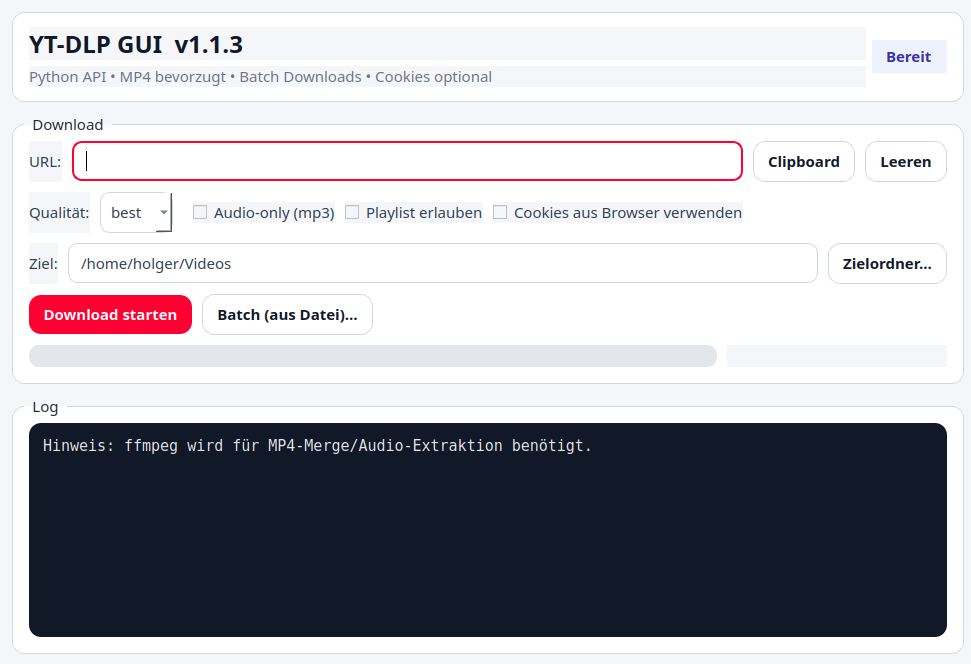

# YT-DLP GUI

Moderne Desktop-GUI für **yt-dlp (Python API)**  
Erstellt mit **PySide6** – inklusive Batch-Download, Cookie-Unterstützung und Fortschrittsanzeige.

---
## 🖼 Screenshot



---

## ✨ Features

- YouTube-URL manuell oder per Clipboard
- Shorts / youtu.be → automatische Normalisierung
- Qualität auswählbar (best / 1080 / 720 / 480 / 360)
- MP3 Audio-Only
- Playlist erlauben / blockieren
- Optional: Cookies aus installiertem Browser verwenden
- Batch-Download aus Textdatei
- Fortschrittsanzeige mit ETA & Speed
- Automatischer Cookie-Fallback (mit → ohne Cookies)
- Modernes UI (Dark Log + Styled Buttons)
- Versionsanzeige im Fenster

---

## 🔧 Voraussetzungen (Laufzeit)

Die App benötigt:

- **ffmpeg** (für MP4-Merge & MP3-Extraktion)

### Linux
```bash
sudo apt install ffmpeg
```

### Windows
```powershell
winget install Gyan.FFmpeg
```

---

## 🚀 Start aus Source

### Linux / macOS
```bash
python3 -m venv .venv
source .venv/bin/activate
pip install -r requirements.txt
python ytdl_gui.py
```

### Windows
```powershell
python -m venv .venv
.venv\Scripts\activate
pip install -r requirements.txt
python ytdl_gui.py
```

---

## 🏗 Build (Onefile Binary mit PyInstaller)

```bash
pyinstaller --noconsole --onefile ytdl_gui.py
```

Die Binary liegt danach in:

```
dist/ytdl_gui        (Linux)
dist/ytdl_gui.exe    (Windows)
```

---

## 📦 GitHub Releases

Bei jedem Git-Tag (`vX.X.X`) wird automatisch eine Binary für:

- Ubuntu (Linux)
- Windows

erstellt und als Release-Asset hochgeladen.

---

## 📌 Hinweise

- Cookies funktionieren nur, wenn ein unterstützter Browser installiert ist.
- Wenn Cookie-Download fehlschlägt, wird automatisch ohne Cookies erneut versucht.
- Die Version wird im UI angezeigt.

---

## 🔥 Version

Aktuelle Version: **v1.1.3**
